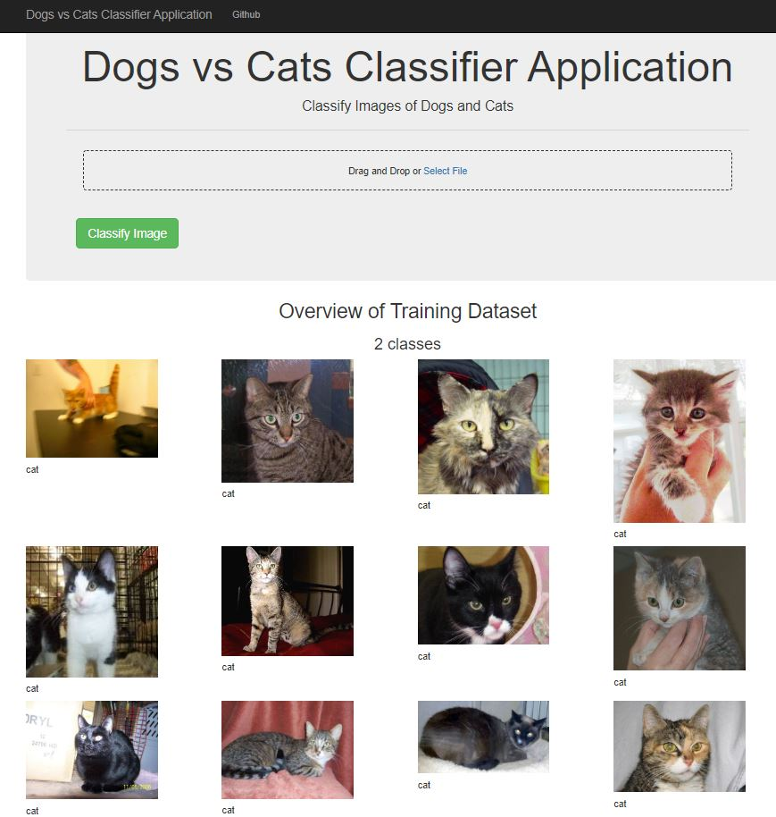
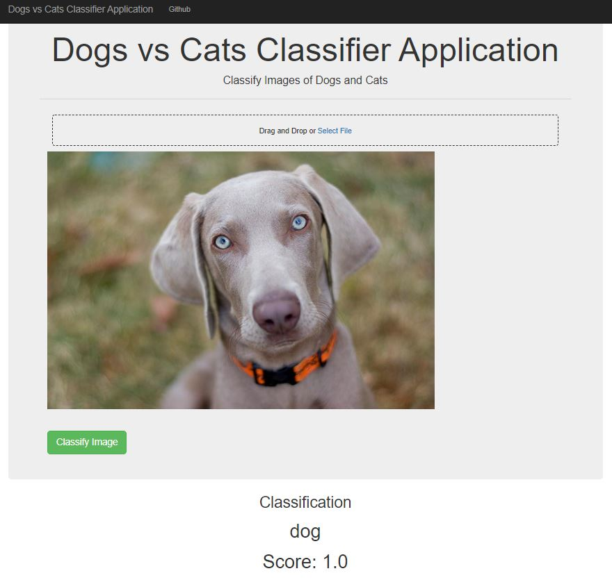

# Dogs vs Cats with Google AutoML

## Introduction

The goal of the project is to use [Google AutoML](https://cloud.google.com/automl) to classify whether images contain either a dog or a cat

## Software and Libraries

This project uses Python 3.8.2 and the following libraries:

* [Google Cloud](https://pypi.org/project/google-cloud/)
* [dash](https://plot.ly/dash/)

## Data

Data was provided by [Kaggle](https://www.kaggle.com/c/dogs-vs-cats/data):
- **test**: folder with 12500 images of dogs and cats to be used as test dataset
- **train**: fodder with 25000 images of dogs and cats with the label in the image name i.e cat.0.jpg, dog.0.jpg
- **sampleSubmission.csv**: csv file to use as reference for the submission when participating at the competition

## Running the code

The code for generating the `all_data.csv` to map the images to let Google AutoML Vision generate a model is provided in the [Jupyter Notebook](http://ipython.org/notebook.html) _dogs_vs_cats.ipynb_

If you download it simply run the command `jupyter notebook dogs_vs_cats.ipynb` in the folder were the file is located

From the project folder run `python dash_dogs_vs_cats_classifier.py` to start the dash application. The default url to connect to it is http://127.0.0.1:8050/

## Results

The dash application 

When no image is give in input the application gives an overview of the dataset in the home page

When an image is submitted with the **Classify Message** button the resulting category is shown

Results are better explained in this [blog post](https://towardsdatascience.com/classify-dogs-and-cats-with-google-automl-2ae6eac64117)

## Licensing and Acknowledgements

Thanks to [Kaggle](https://www.kaggle.com/) for the dataset
